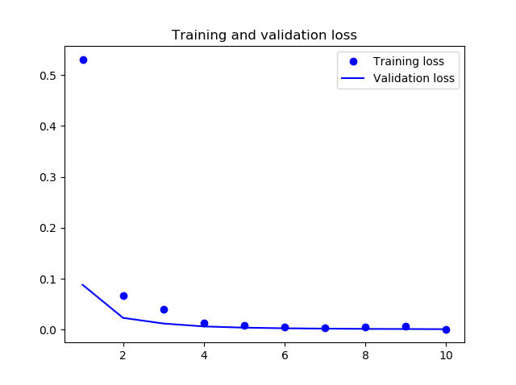

# count-of-1s-keras
Given a binary string (a string with just 0s and 1s) of length 20, determine the count of 1s in a binary string.

Well, Its a trivial task and would take a minute to solve this using this code with 100% accuracy:
```
count = 0
for i in string:
    if i == '1':
        count+=1
```
However, these rules are provided to the machine by human. In order to make the machine derive rules by itself we take the DL approach, here *shallow learning* to be precise.

This problem can be described as sequence classification and this is where RNNs come in picture. But as the lengths of string(sequence) increases, the gradients computed during their training either vanish or explode causing training latency.
LSTMs are modified RNNS which solve the gradient problem by introducing a few more gates that control access to the cell state.

**LSTM layer**:

```
model = Sequential()
model.add(LSTM(20, input_shape=(20,1)))
model.add(Dense(21, activation='softmax'))
```

Model is trained and saved for string lengths of 20.
In order to train the model for other string lengths follow steps:
1. change str_len = *len* in config.py file
2. run main_training.py
3. test with ```python count_of_1s.py``` *string*

Training was done until accuracy reaches 99.8%, as the loss graph wasn't going anywhere else after that :P. Anyways, callback is used just for the sake of it :).



This is one of the most simplified version of sequence classification using RNNs. More advanced models can be built upon this in accordance with problem statement by adding more layers (Embedding, Dense etc.).

